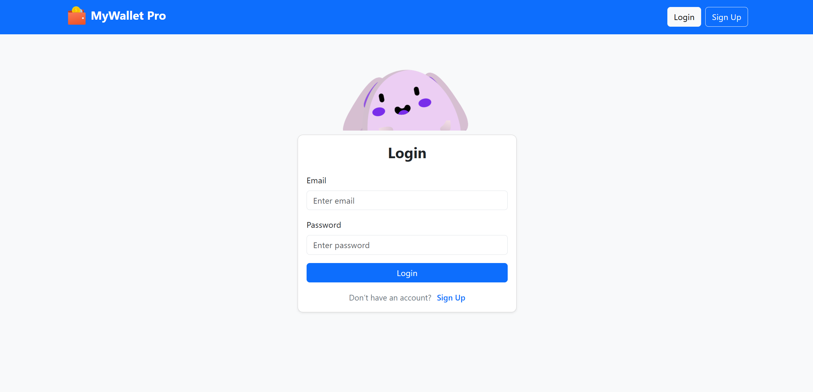
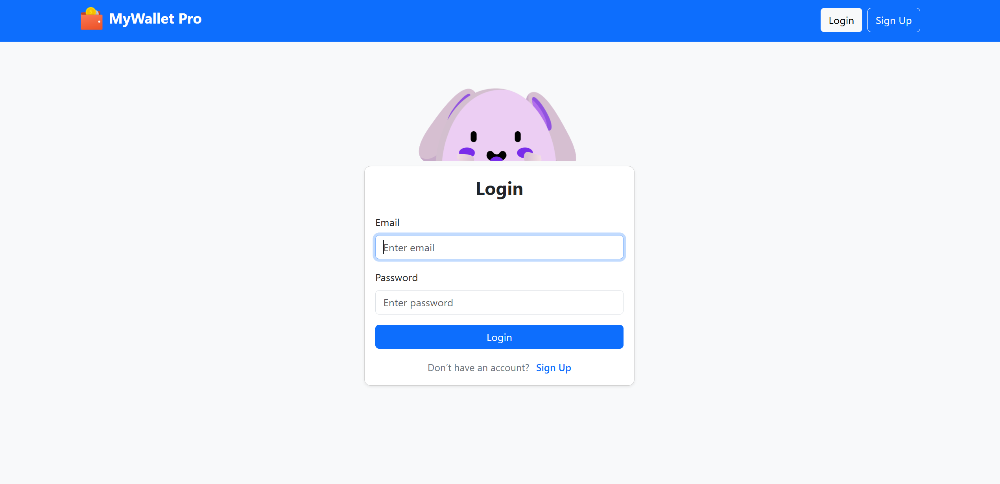
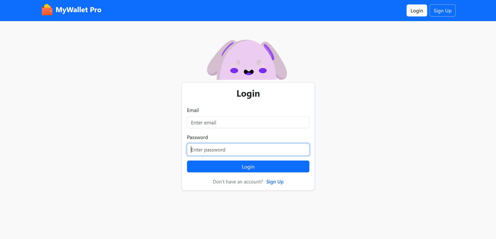
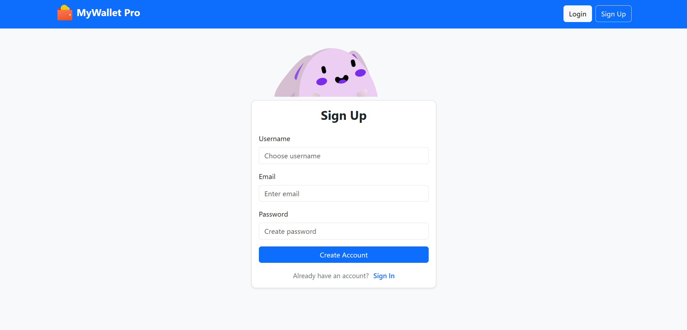
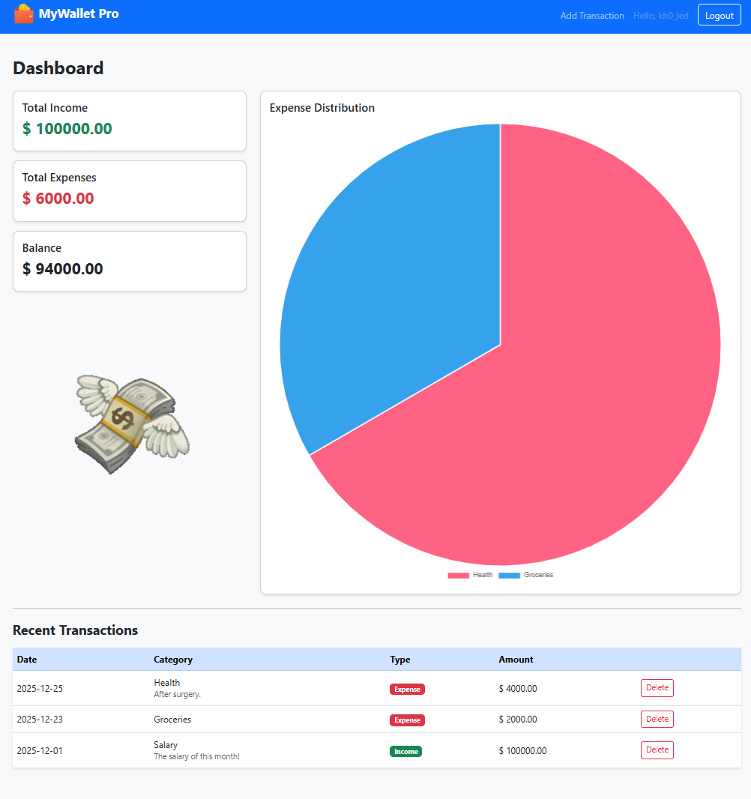
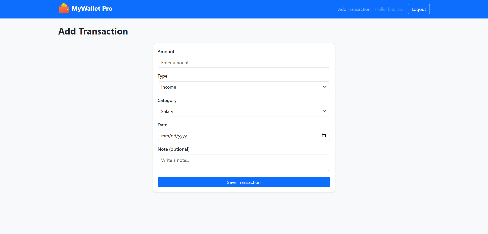

# MyWallet Pro

**MyWallet Pro** is a full-stack personal finance tracking web application built with Flask.  
It allows users to securely manage income and expenses, visualize spending by category, and track their financial balance through an intuitive dashboard.

The application features session-based authentication, ORM-backed data modeling, interactive charts, and animated UI elements.  
It is fully deployed on PythonAnywhere and accessible as a live web application.

---

## 🌐 Live Demo

The application is deployed and publicly accessible.

🔗 **Live URL:**  
https://khaled2003elsayed.pythonanywhere.com/login

Anyone can:

- Register a new account
- Log in securely
- Add and manage personal transactions
- View charts and analytics in real time

> ⚠️ Demo note: This is a shared environment. Do not use real financial data.

---

## ✨ Features

- 🔐 **User Authentication**

  - Register / Login / Logout
  - Secure password hashing using **Flask-Bcrypt**
  - Session-based authentication with route protection
  - Deployed authentication flow tested in production (PythonAnywhere)

- 💸 **Transaction Management**

  - Add income and expense transactions
  - Separate category lists for income & expenses
  - Optional notes per transaction
  - Delete transactions securely

- 📊 **Dashboard & Analytics**

  - Total income, total expenses, and balance summary
  - Pie chart showing expense distribution by category (Chart.js)
  - Recent transactions table

- 🎨 **Modern UI**

  - Bootstrap 5 styling
  - Reusable template components (navbar, transaction table)
  - Animated money GIF on dashboard

- 🐰 **Interactive Rive Animation**

  - Login & Register pages feature a Rive character
  - Character reacts when:

    - Focusing on text inputs
    - Typing password (eyes close)

---

## 🧠 Tech Stack

- **Backend:** Flask (Python)
- **Frontend:** HTML, CSS, Bootstrap 5, JavaScript
- **Database:** SQLite (via SQLAlchemy ORM)
- **Charts:** Chart.js
- **Animations:** Rive (Canvas runtime)
- **Security:** Flask-Bcrypt, session-based auth
- **Environment Config:** python-dotenv
- **Deployment:** PythonAnywhere

---

## 📁 Project Structure

```
MyWallet_Pro/
│
├── app/
│   ├── __init__.py
│   ├── extensions.py
│   ├── helpers.py
│   ├── models.py
│   ├── routes.py
│   │
│   ├── templates/
│   │   ├── components/
│   │   │   ├── navbar.html
│   │   │   └── transaction_table.html
│   │   │
│   │   ├── base.html
│   │   ├── login.html
│   │   ├── register.html
│   │   ├── dashboard.html
│   │   └── add_transaction.html
│   │
│   └── static/
│       ├── css/
│       │   └── style.css
│       │
│       ├── js/
│       │   ├── charts.js
│       │   ├── category_toggle.js
│       │   ├── rive_login.js
│       │   └── rive_register.js
│       │
│       ├── images/
│       │   └── money_anim.gif
│       │
│       └── rive/
│           └── login_bunny.riv
│
├── screenshots/
│   ├── 01_login.png
│   ├── 02_login_email_focus.png
│   ├── 03_login_password_focus.png
│   ├── 04_register.png
│   ├── 05_dashboard.png
│   └── 06_add_transaction.png
│
├── config/
│   ├── .env
│   └── .env.example
│
├── instance/
│   └── mywallet.db
│
├── run.py
├── requirements.txt
├── LICENSE
├── .gitignore
└── README.md

```

---

## ⚙️ Environment Setup

Create a `.env` file inside the `config/` folder:

```env
SECRET_KEY=your-secret-key-here
DATABASE_URL=sqlite:///mywallet.db
```

> Use `.env.example` as a reference.

---

## 🚀 Installation & Run

### 1️⃣ Clone the repository

```bash
git clone https://github.com/khaledelsayed2003/MyWallet_Pro.git
cd MyWallet_Pro
```

### 2️⃣ Create & activate virtual environment

```bash
python -m venv venv
source venv/bin/activate  # Windows: venv\Scripts\activate
```

### 3️⃣ Install dependencies

```bash
pip install -r requirements.txt
```

### 4️⃣ Run the app

```bash
python run.py
```

Open your browser at:

```
http://127.0.0.1:5000
```

---

## 🔐 Authentication Flow

- Users must log in to access dashboard and transactions
- Protected routes use a custom `@login_required` decorator
- Sessions store `user_id`
- Passwords are **hashed**, never stored in plain text

---

## 📊 Charts & Categories

- Expense categories are summarized dynamically
- Chart data is safely passed from Flask → JS using `tojson`
- Category selector switches automatically between income & expense lists

---

## 🚀 Deployment

The application is deployed on **PythonAnywhere**.

Deployment includes:

- Production environment configuration
- Environment variables for secrets
- Persistent SQLite database
- Public access with real user sessions

Live users can create their own accounts and use the system independently.

---

## 📸 Screenshots

### 🔐 Login Page

Clean and minimal login interface with an interactive animated character.



---

### 👀 Login – Input Focus Animation

The character reacts when the user focuses on the email field.



---

### 🙈 Login – Password Privacy Animation

The character closes its eyes when the password field is focused.



---

### 📝 Register Page

User registration with the same interactive animated character behavior.



---

### 📊 Dashboard Overview

Main dashboard showing total income, expenses, balance, animated mood indicator, and expense distribution chart.



---

### ➕ Add Transaction

Form to add income or expense with dynamic category selection.



---

## 🎬 Rive Animation Logic

- **Login page**

  - Focus email → character looks attentive
  - Focus password → character closes eyes

- **Register page**

  - Focus username/email → attentive
  - Focus password → eyes close

All animations are handled via **state machine inputs** in `login_bunny.riv`.

---

## 📌 Future Improvements

- Forgot password (email verification)
- Pagination for transactions
- Monthly / yearly reports
- Dark mode
- REST API version

---

## 📄 License

This project is licensed under the **MIT License**.

---

## 👨‍💻 Author

Built with ❤️ by **Khaled Elsayed**

---
